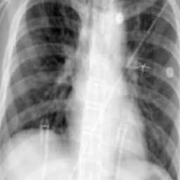
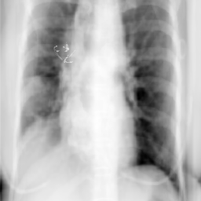
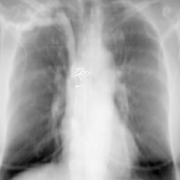

# RFO_DeepDRR
This is the code and dataset page for paper "A Dataset and Benchmark for Enhancing Retained Foreign Object Detection Through Physics-based Image Synthesis". RFO-DeepDRR is a novel physics-based pipeline specifically designed to generate realistic synthetic radiographs using a clinically relevant RFO rendering model.

## Synthetic dataset
The sample synthetic dataset is available in [Dataset](./Dataset). The images and label are restored in paired .zip file and .csv file (e.g. full500.zip and full500.csv).  Some examples are shown below:

  

Currently, only a dataset of size 500 is uploaded as a sample. **More and larger datasets are going to be here as time goes.**

## Rendered RFO models 
Many RFO 3D models that are believed to be very common in clinical surgeries have been uploaded into [RFO models](./RFO_models). The RFO 3D model list is shown as follows. 

| RFO type  | File(folder) name |
|-----------|-------------------|
| Cotton ball |  DEROYAL_cotton_ball |
| X-ray detectable sponge |  MEDLINE_xray_detectable_sponge |
| Uniqcot   |  ASC_uniqcot.obj |
| Blade |  BP_stainless_steel_blade.obj |
| Surgical patties | CODMAN_surgical_patties.obj |
| Electrode |  COVIDIEN_electrode.obj |
| Suture |  ETHICON_suture.obj |
| Ivc filter |  ivc_filter.obj, ivc_filter_2.obj |
| Sponge |  TONSIL_sponge.obj |
| Aid booties |  ASPEN_suture_aid_booties.obj |
| Wires |  cotton_wires |

All the RFO models are saved as .obj files. Since the pipeline is set to load dicom files as input, we also provide an example script ([obj2dcm.py](./RFO_models/obj2dcm.py)) to convert these .obj files into .dcm files. Revise it as you want.

## Pipeline Usage

The **RFO_DeepDRR** pipeline primarily consists of three components:  
- **DeepDRR** ([v0.1 release](https://github.com/arcadelab/deepdrr/releases/tag/0.1))  
- **TotalSegmentator** ([GitHub link](https://github.com/wasserth/TotalSegmentator))  
- **TripoSR** ([GitHub link](https://github.com/VAST-AI-Research/TripoSR))

For **TotalSegmentator** and **TripoSR**, please refer to their respective GitHub pages for installation and usage instructions.  
The outputs generated by these two tools can be directly used as inputs to our **revised version of DeepDRR (v0.1)**, which serves as the backbone of this pipeline.

All related scripts for the modified DeepDRR are located in the [`code`](./code) directory.  
Before running the code, please ensure your environment meets the **DeepDRR v0.1 requirements** listed in its repository.  
> **Note:** Our implementation has been tested only on **CUDA 11.8**.

To execute the pipeline, run the example script [`example_projector_multi_tools.py`](./code/example_projector_multi_tools.py).

### Additional Notes

- **Using your own RFO 3D models:**  
  If you plan to use custom RFO 3D models instead of ours, update the **density dictionary** and **attenuation coefficients** in [`materials.py`](./code/materials.py).  
  These parameters are essential for accurate computation in the imaging equations.

- **CT volume loading:**  
  By default, CT volumes are loaded from DICOM files.  
  To load from NIfTI format, use the `load_nifti_CT()` function provided in [`load_dicom_tool.py`](./code/load_dicom_tool.py).

- **CT segmentation:**  
  - If you prefer to use **TotalSegmentator**, set the `segmented_files_path` variable in [`example_projector_multi_tools.py`](./code/example_projector_multi_tools.py) to the output directory generated by TotalSegmentator.  
    Ensure that the segmentation and the CT volume are spatially aligned (i.e., not flipped, cropped, or truncated) before use. You can verify this alignment within the `load_dicom_CT_new()` function.  
  - If you prefer **not** to use TotalSegmentator, a simple **threshold-based segmentation** can also produce reasonable results.  
    To enable this option, set `use_thresholding_segmentation=True` in the DICOM loading function (`load_dicom_CT()` or `load_dicom_CT_new()`).

