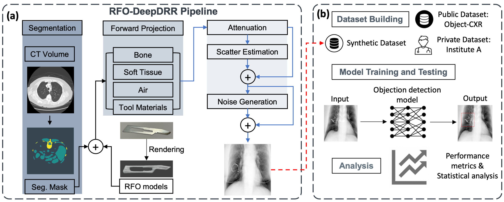

# RFO_DeepDRR
This is the code and dataset page for paper "A Dataset and Benchmark for Enhancing Retained Foreign Object Detection Through Physics-based Image Synthesis". RFO-DeepDRR is a novel physics-based pipeline specifically designed to generate realistic synthetic radiographs using a clinically relevant RFO rendering model

## Synthetic dataset
The sample synthetic dataset is available in [Dataset](./Dataset). The images and label are restored in paired .zip file and .csv file (e.g. full500.zip and full500.csv).  

Currently, only a dataset of size 500 is uploaded as a sample. **More and larger datasets are going to be here as time goes**

## Rendered RFO models 
We have uploaded many RFO 3D models into [RFO models](./RFO_models). These RFOs are believed to be very common in clinical surgeries. Here is the RFO 3D model list. All the RFO models are saved as .obj files. Since the pipeline is set to load dicom files as input, we also provide an example script([obj2dcm](./RFO_models/obj2dcm.py)) to convert these .obj files into .dcm files. Revise it as you want.

| RFO type  | File(folder) name |
|-----------|-------------------|
| Cotton ball |  DEROYAL_cotton_ball |
| X-ray detectable sponge |  MEDLINE_xray_detectable_sponge |
| Uniqcot   |  ASC_uniqcot.obj |
| Blade |  BP_stainless_steel_blade.obj |
| Surgical patties | CODMAN_surgical_patties.obj |
| Electrode |  COVIDIEN_electrode.obj |
| Suture |  ETHICON_suture.obj |
| Ivc filter |  ivc_filter.obj, ivc_filter_2.obj |
| Sponge |  TONSIL_sponge.obj |
| Aid booties |  ASPEN_suture_aid_booties.obj |
| Wires |  cotton_wires |

![rendering](./RFO_models/rendering.png

## Want to run RFO_DeepDRR pipleline?
This part will be completed after the paper is accepted. Thank you!
